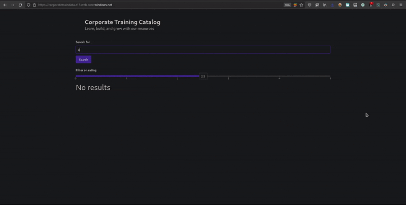

### Project: Build an AI Enriched Corporate Training Catalog
This is my submission for the Udacity's AI Engineer using Microsoft Azure Nanodegree Program third project, an AI-Enriched Corporate Training Catalog. Many companies rely on both internal and external training for their employees, and for this project, we will build a one-stop knowledge mining application that combines information from external sources, enriches that data, and creates a user interface for end users to sift through all their learning options.

The final result website can be accessed at https://corporatetraindata.z13.web.core.windows.net/

#### Website demo

#### Problem Definition
The company provides training opportunities for technical staff using a combination of internal and external sources. The company is a Microsoft Gold Certified Partner and also engages with Udacity to provide external training. In addition, the company maintains a library of select open-access journal articles relevant to their work and also provides their own internal Moodle site for training.

Currently, employees are having a hard time sifting through the disparate sources of training in order to find the right resource and HR has a plan to incorporate even more opportunities for the staff. To help people find the resources that are best for them, the company has decided to build an Azure Cognitive Search solution.

The company wants users to be able to search Course Data by keywords and phrases from descriptions and other fields and return meaningful results. In addition, the company wants users to be able to filter results based on relevant criteria such as course ratings or duration. The company has profiles for each of the course instructors for their own internal training and would like to have those returned in the search results even though they are not currently in the database. The company would like users to be able to facet information based on relevant fields such as source, skills, or role. Finally, the company wants users to be able to sort results by relevant fields.

In addition to the Course Data, the company wants to make available a curated set of open access journal articles in PDF form that are related to their big data work. These articles should be searchable by keywords and phrases, authors, and their associated institutions. In addition, the company wants users to be able to search using publication name, publisher, and publication date. Users should be provided the DOI (Digital Object Identifier) URL for the file as part of the search result.

The data available from each data source is outlined below:

##### Course Data
  - Title
  - Description
  - Duration
  - Source [MS, Udacity, Internal]
  - Type [Module, Nanodegree, Internal]
  - Level
  - Role
  - Technology
  - Popularity
  - Rating
  - Rating Count
  - Url
  - Review (Only for internal courses)
  - Instructor (Only for internal courses)

##### Curated Library
 - Set of curated PDF articles

